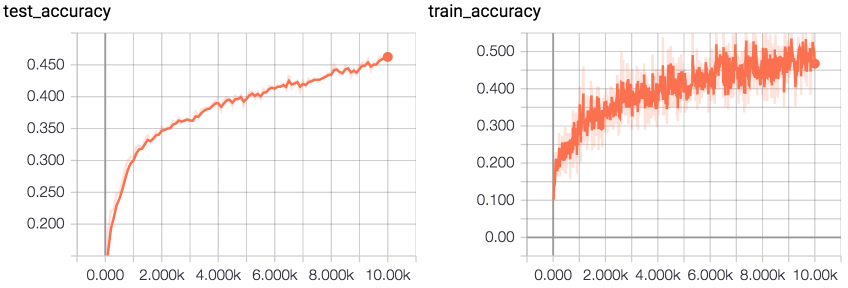

# SqueezeNet on CIFAR10

This is my implementation of SqueezeNet paper in low level tensorflow.
Original paper was trained on ImageNet, but the dataset is restricted so
instead I have used CIFAR10. Note that ImageNet images have shape of
[224x224] in contrast to CIFAR10 with images of shape [32x32], so
this network has been adjusted to run on smaller image by decreasing
maxpool kernel sizes from [3x3] to [2x2] (see `model()`'s parameter 
`pooling_size`). Also, since this network is too big for such small
images, learning rate has to be small to achieve any progress.

* [SqueezeNet: AlexNet-level accuracy with 50x fewer parameters and <0.5MB model size](https://arxiv.org/abs/1602.07360) (Iandola et al, 2016)

## Training/accuracy
- steps: 10000
- minibatch size: 128
- running time: ~61mins (MacBook Pro 2015)
- training accurracy: 45.3%
- test accurracy: 46.3%

```
Iteration: 9500	 loss: 1.504	 accuracy: 0.406	 test accuracy: 0.453
Iteration: 9600	 loss: 1.596	 accuracy: 0.430	 test accuracy: 0.451
Iteration: 9700	 loss: 1.393	 accuracy: 0.484	 test accuracy: 0.462
Iteration: 9800	 loss: 1.463	 accuracy: 0.484	 test accuracy: 0.461
Iteration: 9900	 loss: 1.508	 accuracy: 0.453	 test accuracy: 0.463
Iteration: 10000	 loss: 1.541	 accuracy: 0.453	 test accuracy: 0.464
running time: 1:01:39.241827
```



## Further steps
- add L2 regularization, increase LR, LR decay